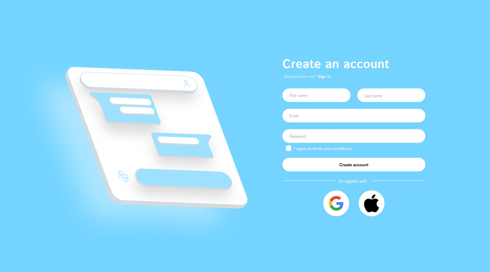

  

<h1 align="center">💬 Waverr is a Real-Time Chat Application (WIP) 💬</h1>

> A blazing-fast, full-duplex communication platform built on the **MERN stack** — featuring **real-time messaging**, **group chats**, **media sharing**, and more. Designed with scalability, performance, and sleek UI in mind.

---

## 🧰 Tech Stack

> **MERN + TailwindCSS**

  
  
  
  
  
  
  

---

## 🚧 Project Status

> 🔄 Under Active Development  
> 🧠 Brainstorming UI/UX enhancements  
> 🧪 Implementing real-time features  

---

## ✨ Core Features

- 🔁 **Full-duplex messaging** with Socket.IO  
- 🧑‍🤝‍🧑 **One-on-one and group chat support**  
- 🗂️ **Create communities** and discussion spaces  
- 📸 **File and media sharing** (Coming soon)  
- 🔔 **Instant notification sounds**  
- 🟢 **Live online/offline presence**  
- 🎥 **Voice & Video calling** (In pipeline)  
- 📱 **Responsive across all devices**

---

## 🖼️ Screenshots

### 🔍 Login page
